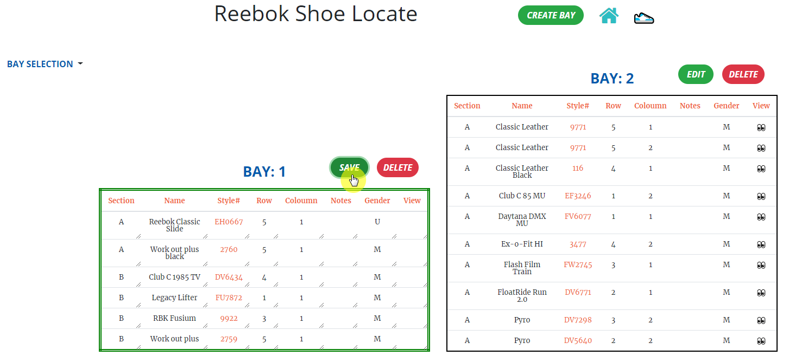

# Full Stack Shoe Locator App
____
## The Problem
Upon working in the retail industry for some time I have notice that searching for shoes by using your eyes to find the style code written a posted note thats placed on a bay can be inefficient and cost valuable time. 

### Why it's important
As any great salesman knows, time is key when showcasing professional salesmanship. The faster you can service the customer with retrieving the item they potentially want to purchase -  the faster you can have them confirm that potential purchase. Customers want three things when leaving your store; to be heard, to recieve solutions to their problems, and to have a unique expereience. If you can provide all three of these needs then you build loyalty and trust which leads to returning customers who continue to seek your salesmanship. However, as stated above finding a shoe within a collection of bays can be trivial.

### The old solution
Normally one way to become faster at this was to remember where certain shoes were ahead of time. However, every retail season means a change in product for the store. In our case this means the bays will get populated with new shoes. This rearragnement of shoes means that remembering where a shoe is becomes remembering where a shoe was. Remembering becomes inefficent after a couple months. This leads the sales team to constanly repeat the cycle of remembering where a shoe is all over again. Whats worse is that your old memeories of where a shoe was can someitmes confuse you.

### The new solution
Let an app remember for you!

## The Pitch
As we should all know, the more time spent being confused when helping a customer can hinder salesmanship and affect not just yourself but the store as well. By using Shoe Locate you can be FASTER. Return to the customer with their product faster and allow less of a chance of doubt and or a change in mind to occur. Focus more of you time on the sale and build upon that unique interaction with the customer so that the customer leaves the store with a feeling that he or she had a unique memorable experience. Time correlates to every sales metrics. Spend less time remembering and more time planning on everything else to secure that sale. Increase your store KPI's and let the stores sales margins be a reflection of salesmanship and not a reflection of shoe bay memorization.

**Let Shoe Locate remember where everything is in your bays.**

### What solutions does Shoe Locate provide?

**Using Shoe Locate will give you the ability to automate bay management and help save time for finding shoes!**
- Shoe finder
  - **` As an associate you can:`**
    1. Click the Associate button to get reidrected to the shoe-locate assistance view.
        - 
    2. Type in the style code number and the app will direct you exactly where to go.
        -  

- Bay management
    - **`As a manager, you can:`**
      1. log in and manage the bay system database.
            -  
      2. View any and or all bays in your database.
            - 
      3. Create a bay and populate it with shoes.
            -  
      4. Edit an existing bay repopulating it with data.
         -  
      5. Delete bays no longer in use along with all its data.
            -  

# Getting Started
Here is how you can get started.

## Forking the Project

[Fork](https://help.github.com/en/articles/fork-a-repo) the [project repository]() and [Clone](https://help.github.com/en/articles/cloning-a-repository) your forked repository to your machine. Work on the project locally if you'd like.

**Shoe Locate:** [Fork URL](https://github.com/DoubleHelixX/shoe-locator.git) 

## About the Stack

Shoe Locate is a full stack application implementing these technologies: 
- **Python3** and **Flask** as our server language and server framework
- **Gunicorn** as our deploment server
- **Jinja2** for itegrating our data to the frontend seamlessly 
- **SQLAlchemy ORM** to be our ORM library of choice
- **PostgreSQL** as our database of choice
- **Auth0 API** as our authorization/authentification service 
- **HTML**, **CSS**, and **Javascript** with [Bootstrap 3](https://getbootstrap.com/docs/3.4/customize/) for our website's frontend
- **Flask-Migrate** for creating and running schema migrations
- **Heroku** our deployment service of choice for Deployment

### Main Files: Project Structure

  ```sh
  ├── README.md
  ├── README_BACKEND.md
  ├── Profile *** For heroku deployment ***
  ├── app.py *** the main driver of the app. Multiple Endpoints
                    "python app.py" to run after installing dependences
  ├── constants.py *** Database URLs, CSRF generation, etc
  ├── auth.py *** auth0 config logic
  ├── models.py ***  Includes your SQLAlchemy models ***
  ├── manage.py *** database configuration and setup ***
  ├── test_api.py *** python unit test for testing the endpoints ***
  ├── setup.sh *** environment variables ***
  ├── error.log
  ├── requirements.txt *** The dependencies we need to install with "pip3 install -r requirements.txt"
  ├── shoe_locate_global.postman.json *** postman testing for endpoints ***
  ├── shoe_locate_local.postman.json *** postman testing for endpoints ***
  ├── bays_.csv *** csv file to import Bay data ***
  ├── static/assets
  │   ├── bootstrap
  │   │   │
  │   │   ├── css
  │   │   └── js
  │   ├── css 
  │   ├── img
  │   └── js
  └── templates
      ├── associate-view.html
      ├── home.html
      ├── layout.html
      └── manager-view.html
      
  ```
## README

Please refer to the readme files

1. [`frontend.md`](./templates/README.md)

2. [`backend.md`](./README_BACKEND.md)

I recommend following the instructions in those files in order.

### Frontend
The `./templates` directory contains the frontend logic. I am using Jinja2 to pass data and render the manager pages. Please read [`frontend.md`](./templates/README.md) for more information.

### Backend
The `./shoe-locator` directory contains a  completed Flask and SQLAlchemy server. Within the app.py are defined endpoints which uses models.py for the database and SQLAlchemy setup. Please read [`backend.md`](./README_BACKEND.md) for more information.

## Authorization/Authentication
_Depreciated until further notice_:
~~The `./backend` directory contains a auth.py file which uses Flask.oauth with utilities library to handle the auth0 login request for authentication and then check for authorization for accessing endpoints pertaining for a manager to access.~~

_In use_:
The `./shoe-locator` directory contains a [`constants.py`](./backend/constants.py) file that supplies the Bearer tokens to the [`auth.py`](./auth.py) file which checks for authorization for accessing endpoints pertaining for a manager to access. [View the README.md within ./backend for more details.](./backend/README.md).

## Run & Test

### Running & Testing

#### `Python 3.7`
A) Follow instructions to install the latest version of python for your platform in the [python docs](https://docs.python.org/3/using/unix.html#getting-and-installing-the-latest-version-of-python)

B) In order to run the application:
  1)  **First make sure your environment is active:**
    - [How to set up a python virtual environment](https://packaging.python.org/guides/installing-using-pip-and-virtual-environments/).

#### `PIP Dependencies`
 
  2) **Next navigate to the backend folder and run the following commands:**
     - **Install the requirements:**
          ```
          pip3 install -r requirements.txt
          ``` 
     - **set Flask App:** `Set according to your path`
          ```
          set FLASK_APP=app.py
          ```   
     - **Run Application:**
          ```
          flask run
          ```  
     
  3) This project uses the `Better Comments` Extension for showcasing comments. Install [Here](https://marketplace.visualstudio.com/items?itemName=aaron-bond.better-comments)
  4) Omit the  `db_drop_and_create_all()` & ` db_initialize_tables_json() ` methods to pump starter data in the database. 

### Testing
In order to run tests:
1)  **First make sure your environment is active:** 
    - [How to set up a python virtual environment](https://packaging.python.org/guides/installing-using-pip-and-virtual-environments/).
2) **Next navigate to the backend folder and run the following commands:**
```
python test_api.py
```
- The test is coded so that it drops, creates, and initializes the databases tables with data upon running. 
- The **db_drop_and_create_all()** method located in the [`models.py`](./backend/models.py) file drops and create the tables in the database.
- The data is supplied by the [`constants.py`](./constants.py) file which holds a dictionary of data within a variable. 
- The **db_initialize_tables_json()**method  located in the [`models.py`](./models.py) file uses that constant variable to insert all that data to the datatables respectivly.

**`All tests are kept in that file and should be maintained as updates are made to app functionality.`**
- **Alternatively you can use Postman to test the endpoints as well.** 
- **`Make sure to initialize data in the database first as mentioned earlier before testing.`**
  - **The Postman collection `"shoe_locate.postman_collection.json"` is located within the `./shoe_locate directory`**
      - Local Collection
        - [LOCATED HERE](shoe_locate_local.postman_collection.json).
      - Global Collection
        - [LOCATED HERE](shoe_locate_global.postman_collection.json).
     
## API Reference

### Deployment
- Base URL: This app can only be run locally and or by clicking this [URL](https://shoe-locate.herokuapp.com).
- Locally:
    - The backend app is hosted at the default, `http://127.0.0.1:5000/`
- Globally
    - The backend app is hosted at the default, `https://shoe-locate.herokuapp.com`

- _Depreciated until further notice_:
    - Authentication: 
        - ~~Upon running the application the user needs to click the manager button to get prompt to sign into using their auth0 credentials.~~ 
        - ~~From there they will get redirected if they have privileges.~~ 
        - ~~Alternately if you can test the JWTs and endpoints via PostMan and or test_api.py as well.~~ 
            - ~~I include samples in the postman collection.~~
- _In use_:    
     - Authentication: 
        - The constants.py file contains the bearer tokens, database configurations, and data sets. 
        - Change them around if need be.   
        - 
### Error Handling

Errors are returned as JSON objects in the following format:
```
{
    "success": False,
    "error": 422,
    "message": "unprocessable"
}
```
The API will return three error types when requests fail:

- 400: invalid_header, Permissions not included in JWT, bad request
- 401: token_expired
- 403: Permission not found
- 404: Resource Not Found
- 422: Not Processable
- 405: Method not allowed
- 500: Something is wrong with the server configuration

### Endpoints

#### 1) GET /associate/shoe/<style-code-number>
- General:
    - User gets a prompt toast on the screen indicating where to look to find the shoe.
- Request:    
    - Request Arguments: **integer** id from shoe you want to get data on
    - Request Headers: NONE
    - Requires permission: NONE
    - Should return:
        - an ARRAY containing the shoe_info of the shoe that was selected
        - a NUMBER of the amount of bays that shoe is located  
- **Sample: `curl https://shoe-locate.herokuapp.com/associate/shoe/2759`**
- **Sample Response**
``` 
{
  "shoe_info": [
    {
      "bay": 1,
      "col": "1",
      "gender": "M",
      "id": 1,
      "img": "https://assets.reebok.com/images/h_840,f_auto,q_auto:sensitive,fl_lossy/8f83e3f50e9848fe9999aaf101308ce3_9366/Workout_Plus_Shoes_White_2759_01_standard.jpg",
      "name": "Work out plus",
      "notes": "",
      "row": "5",
      "section": "B",
      "style": "2759"
    }
  ],
  "success": true,
  "total_shoe_results": 1
}
```

#### 2) GET /manager/bay/<bay-id>
- General:
    - User can view specific bay or all bays at once
- Request:
    - Request Arguments: **STRING**  id from BAY you want to view
    - Request Headers: NONE
    - Requires permission: `GET:bays`
    - Should return:
        - an ARRAY of the bay you selected
        - an ARRAYY of the bay_categories
        - a NUMBER of the total_bay_results of shoes
        - a STRING of the BAYID that was selected
- **Sample 1: `curl https://shoe-locate.herokuapp.com/manager/bay/all`**
- **Sample 1 Response:**
``` {
  "baySelected": "all",
  "bay_categories": [
    "1",
    "2"
  ],
  "bay_info": [
    {
      "bay": 1,
      "col": "1",
      "gender": "U",
      "id": 6,
      "img": "https://assets.reebok.com/images/h_840,f_auto,q_auto:sensitive,fl_lossy/e50bbdbdca89459abeb8aafd0150d2ee_9366/Reebok_Classic_Slide_Black_EH0667_01_standard.jpg",
      "name": "Reebok Classic Slide",
      "notes": "",
      "row": "5",
      "section": "A",
      "style": "EH0667"
    },
    {
      "bay": 1,
      "col": "2",
      "gender": "F",
      "id": 5,
      "img": "https://images.unsplash.com/photo-1536787175219-c199c3100742?ixlib=rb-1.2.1&ixid=eyJhcHBfaWQiOjEyMDd9&auto=format&fit=crop&w=634&q=80",
      "name": "CHANGED BABY",
      "notes": "SOME NOTES",
      "row": "4",
      "section": "A",
      "style": "S5454"
    },
    {
      "bay": 1,
      "col": "1",
      "gender": "M",
      "id": 3,
      "img": "https://assets.reebok.com/images/h_840,f_auto,q_auto:sensitive,fl_lossy/821af0d430e045fbab4eab1300da40e2_9366/Fusion_Run_2_Shoes_White_EG9922_01_standard.jpg",
      "name": "RBK Fusium",
      "notes": "",
      "row": "3",
      "section": "B",
      "style": "9922"
    },
    {
      "bay": 2,
      "col": "2",
      "gender": "M",
      "id": 8,
      "img": "https://assets.reebok.com/images/h_840,f_auto,q_auto:sensitive,fl_lossy/a604d220136c496f9be3ab52010c5e38_9366/Classic_Leather_Men's_Shoes_White_9771_9771_01_standard.jpg",
      "name": "Classic Leather",
      "notes": "",
      "row": "5",
      "section": "A",
      "style": "9771"
    },
    {
      "bay": 2,
      "col": "1",
      "gender": "M",
      "id": 9,
      "img": "https://assets.reebok.com/images/h_840,f_auto,q_auto:sensitive,fl_lossy/cee2fbde7f3543f38c95ab6701799e4f_9366/Classic_Leather_Men's_Shoes_Black_116_01_standard.jpg",
      "name": "Classic Leather Black",
      "notes": "",
      "row": "4",
      "section": "A",
      "style": "116"
    },
    {
      "bay": 2,
      "col": "1",
      "gender": "M",
      "id": 10,
      "img": "https://assets.reebok.com/images/h_840,f_auto,q_auto:sensitive,fl_lossy/699634c7eed247bebdc6ab26011c9767_9366/Flashfilm_Trainer_Men's_Training_Shoes_Black_FW2745_01_standard.jpg",
      "name": "Flash Film Train",
      "notes": "",
      "row": "3",
      "section": "A",
      "style": "FW2745"
    },
    
  ],
  "success": true,
  "total_bay_results": 6
}
```

- **Sample 2: `curl https://shoe-locate.herokuapp.com/manager/bay/1`**
- **Sample 2 Response:**
```
{
  "baySelected": "1",
  "bay_categories": [
    "1",
    "2"
  ],
  "bay_info": [
    {
      "bay": 1,
      "col": "1",
      "gender": "U",
      "id": 6,
      "img": "https://assets.reebok.com/images/h_840,f_auto,q_auto:sensitive,fl_lossy/e50bbdbdca89459abeb8aafd0150d2ee_9366/Reebok_Classic_Slide_Black_EH0667_01_standard.jpg",
      "name": "Reebok Classic Slide",
      "notes": "",
      "row": "5",
      "section": "A",
      "style": "EH0667"
    },
    {
      "bay": 1,
      "col": "2",
      "gender": "F",
      "id": 5,
      "img": "https://images.unsplash.com/photo-1536787175219-c199c3100742?ixlib=rb-1.2.1&ixid=eyJhcHBfaWQiOjEyMDd9&auto=format&fit=crop&w=634&q=80",
      "name": "CHANGED BABY",
      "notes": "SOME NOTES",
      "row": "4",
      "section": "A",
      "style": "S5454"
    },
    {
      "bay": 1,
      "col": "1",
      "gender": "M",
      "id": 1,
      "img": "https://assets.reebok.com/images/h_840,f_auto,q_auto:sensitive,fl_lossy/8f83e3f50e9848fe9999aaf101308ce3_9366/Workout_Plus_Shoes_White_2759_01_standard.jpg",
      "name": "Work out plus",
      "notes": "",
      "row": "5",
      "section": "B",
      "style": "2759"
    },
    {
      "bay": 1,
      "col": "1",
      "gender": "M",
      "id": 2,
      "img": "https://assets.reebok.com/images/h_840,f_auto,q_auto:sensitive,fl_lossy/09a42ecf48904d0cb7c1aa8e016bae5f_9366/Club_C_1985_TV_Shoes_White_DV6434_01_standard.jpg",
      "name": "Club C 1985 TV",
      "notes": "",
      "row": "4",
      "section": "B",
      "style": "DV6434"
    },
    {
      "bay": 1,
      "col": "1",
      "gender": "M",
      "id": 3,
      "img": "https://assets.reebok.com/images/h_840,f_auto,q_auto:sensitive,fl_lossy/821af0d430e045fbab4eab1300da40e2_9366/Fusion_Run_2_Shoes_White_EG9922_01_standard.jpg",
      "name": "RBK Fusium",
      "notes": "",
      "row": "3",
      "section": "B",
      "style": "9922"
    },
    {
      "bay": 1,
      "col": "1",
      "gender": "M",
      "id": 4,
      "img": "https://assets.reebok.com/images/h_840,f_auto,q_auto:sensitive,fl_lossy/47c766470b4c4ea5a838ab10016ff115_9366/Reebok_Legacy_Lifter_Flexweave(r)_Men's_Shoes_Black_FU7872_01_standard.jpg",
      "name": "Legacy Lifter",
      "notes": "",
      "row": "1",
      "section": "B",
      "style": "FU7872"
    }
  ],
  "success": true,
  "total_bay_results": 6
}
```
#### 3) PATCH /manager/bay
- General:
     - User can edit an existing bay
- Request:    
    - Request Arguments: NONE
    - Request Headers: (_application/json_)
       1. **string** `bay` 
       2. **Array:Dictionaries** `data` 
    - Requires permission: `patch:bays`
    - **Should return:**
        - an ARRAY of the updated shoes that were altered.
        - an ARRAY of the outdated_shoes that were selected for edit.
        - a NUMBER of the total bays that were altered
        - a NUMBER of the Bay that was selected for editing
- **Sample 1: `curl https://shoe-locate.herokuapp.com/manager/bay -X PATCH`** 
- **Example response:**
``` 
{
  "bay": "1",
  "outdated_shoes": [
    {
      "bay": 1,
      "col": "2",
      "gender": "F",
      "id": 5,
      "img": "https://images.unsplash.com/photo-1536787175219-c199c3100742?ixlib=rb-1.2.1&ixid=eyJhcHBfaWQiOjEyMDd9&auto=format&fit=crop&w=634&q=80",
      "name": "CHANGED BABY",
      "notes": "SOME NOTES",
      "row": "4",
      "section": "A",
      "style": "S5454"
    }
  ],
  "success": true,
  "total_bay_results": 1,
  "updated_shoes": [
    {
      "bay": 1,
      "col": "2",
      "gender": "F",
      "id": 5,
      "img": "https://images.unsplash.com/photo-1536787175219-c199c3100742?ixlib=rb-1.2.1&ixid=eyJhcHBfaWQiOjEyMDd9&auto=format&fit=crop&w=634&q=80",
      "name": "CHANGED BABY",
      "notes": "SOME NOTES",
      "row": "4",
      "section": "A",
      "style": "S5454"
    }
  ]
}
```
#### 4) POST /manager/bays
- General:
    - User can create a new bay and populate it with shoe data.
    - Should return:
        - an ARRAY of the bay created.
        - TRUE or FALSE depending if the bay exist already in the Database.
        - a NUMBER of the bayID that was created.
- Request
    - Request Arguments: NONE
    - Request Headers: (_application/json_)
        1. **String** `bay` 
        2. **Array:Dictionaries** `data` 
    - Requires permission: `post:bays`
- **sample: `curl https://shoe-locate.herokuapp.com/manager/bay -X POST`**
- **Example response:**
```
{
  "bay": 12,
  "created_bay": [
    {
      "bay": 12,
      "col": "2",
      "gender": "M",
      "id": 17,
      "img": "https://bit.ly/31sgwi5",
      "name": "new bay",
      "notes": "Box color is Yellow.",
      "row": "4",
      "section": "A",
      "style": "S5454"
    }
  ],
  "exist": false,
  "success": true
}
```

#### 5) DELETE /manager/bays
- General:
    - User can delete an existing bay and all the data it contained.
    - Should return:
        - an array of the shoes that were deleted
        - the bay that was deleted as a string
        - a NUMBER of the total shoes deleted with the bay
- Request
    - Request Arguments: NONE
    - Request Headers: (_application/json_)
        1. **String** `bay` 
    - Requires permission: `delete:bays`
- **sample: `curl https://shoe-locate.herokuapp.com/manager/bay -X DELETE`**
- **Example response:**
```
{
  "bay": "12",
  "deleted_shoes": [
    {
      "bay": 12,
      "col": "2",
      "gender": "M",
      "id": 17,
      "img": "https://bit.ly/31sgwi5",
      "name": "new bay",
      "notes": "Box color is Yellow.",
      "row": "4",
      "section": "A",
      "style": "S5454"
    }
  ],
  "deleted_total": 1,
  "success": true
}
```
